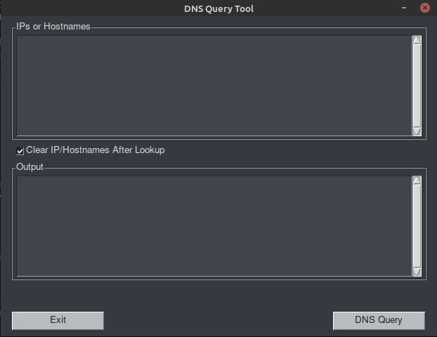
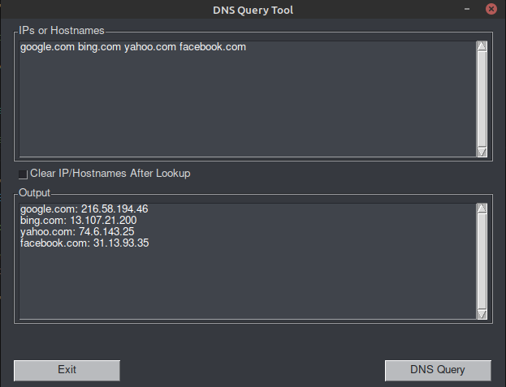
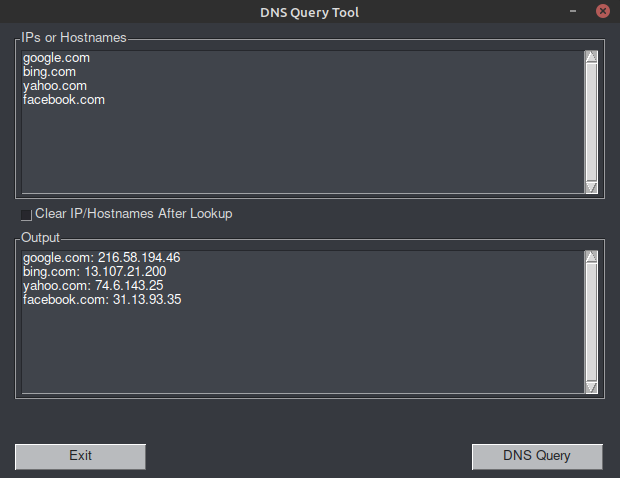
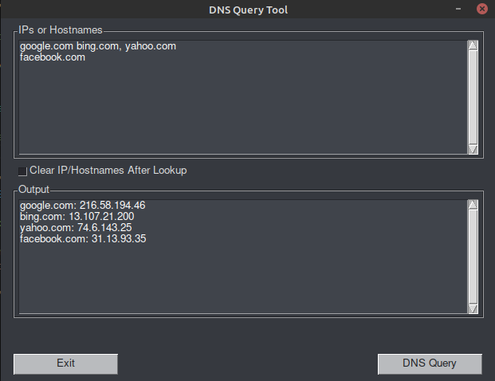

# Introduction

The Host Lookup Tool is a simple GUI implementation of `nslookup` in Python. It's aim is to assist with requests for multiple hosts. It can perform a `nslookup` for a single hostname or IP address or, when needed, multiple hostnames or IP addresses. It's primary aim is on the multiple hosts as performing `nslookup` on multiple hosts from the command line can be time consuming.

Keep in mind a few things please:

- I am a new/beginner python coder, don't be shocked if the code reflects that
- This is a work in progress that I am using to develop my python skills
- If you see something that would improve this, I appreciate any and all constructive criticism

I spent a great deal of time trying to find that _awesome_ project I could build from the ground up before I realized the value of just doing something with python. So I scaled my thinking back some and started looking at what I do day-to-day that I could potentially write code for whether it be work related or personal.

You'll find in my repositories a few projects with Microcontrollers using MicroPython. I absolutely **LOVE** those things. This repo, however, is something spawned from work related tasks. I also very much like creating GUI's for the tools I use. I don't have any issue using the command line, but I like creating the GUI's to have options for those that dont. This project is taking a commonly used command line tool and turning it into something GUI based.

[PySimpleGUI](https://pysimplegui.readthedocs.io/) is the framework that is being used for creating the GUI. I find it much easier and more friendly to use than [tkinter](https://docs.python.org/3/library/tkinter.html).

In my day-to-day work, I am often asked to verify whether or not hosts are in DNS. The list can occasionally be vast and some of the hosts in that list will be in DNS and some won't. Runnig `nslookup` one at a time over so many hosts seems like a perfect opportunity to create Python based tool to do that and do so with a GUI.

# Next Steps

- Improve the source code where possible
- Create a Windows executable file

# Current Screenshots

_Main Window_



_Space Separated Host List_



_Comma Separated Host List_


_List Separated Host List_



_Mixed Delimiters Works_



# Windows Executable

If you would like to build a windows executable file from the Python source code you need to install a Python package `pyinstaller`. This can be done using `pip`.

```python
pip install pyinstaller
```

After that has completed, and from the same directory that the python file, in this case `pynslookup.py` you run the following command:

```python
pyinstaller --onefile -w pynslookup.py
```

The `--onefile` option instructs `pyinstaller` to create just one executable file. The `-w` option suppresses the command window from opening. When the process has completed you will find the windows executable (`.exe`) in the _dist_ folder. Since this is a relatively simple application it will run as a stand alone file on the Windows operating system.

# Contribute

In progress
